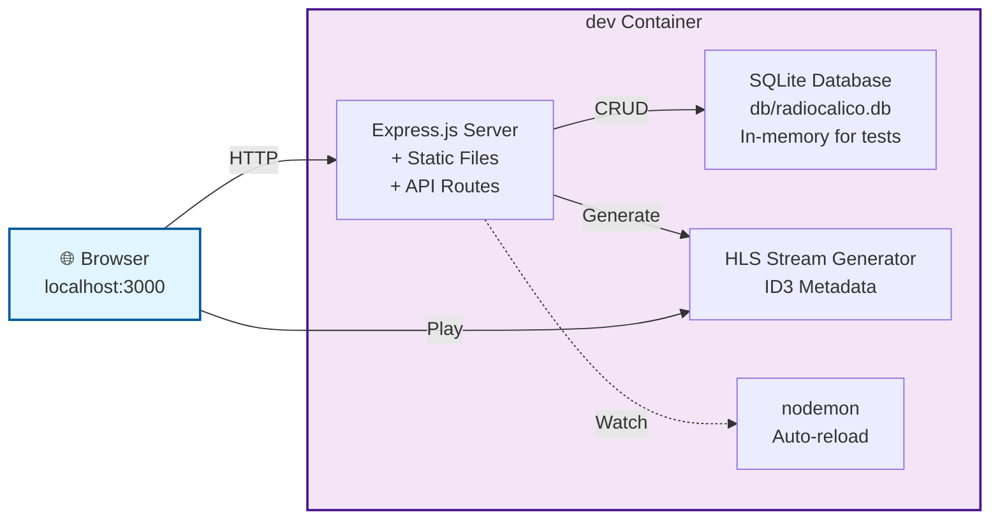
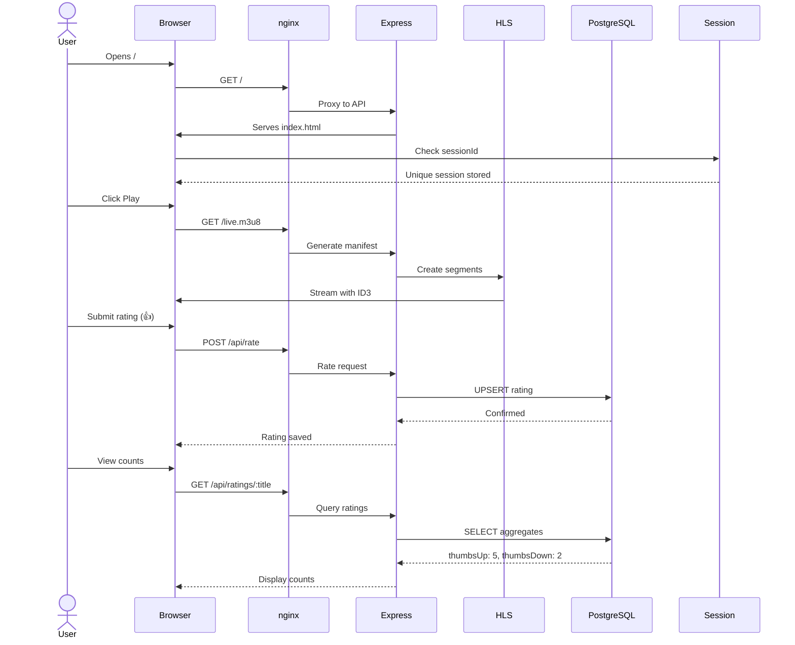
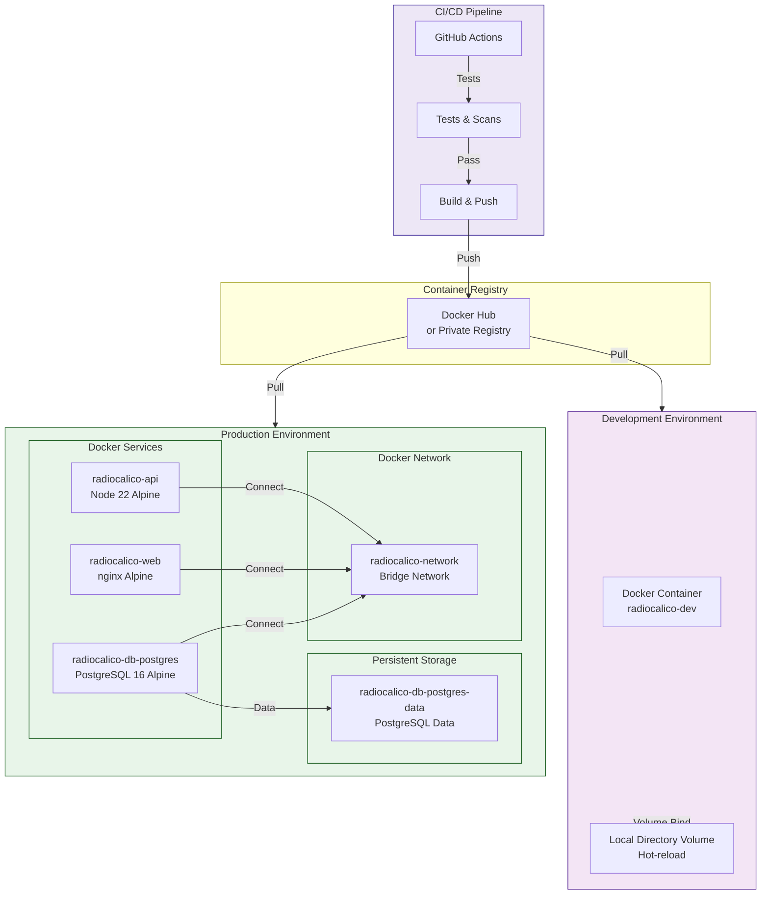
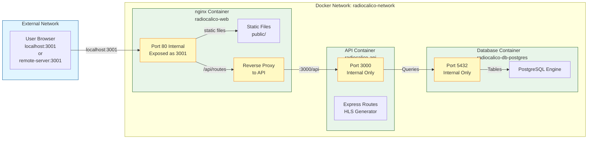
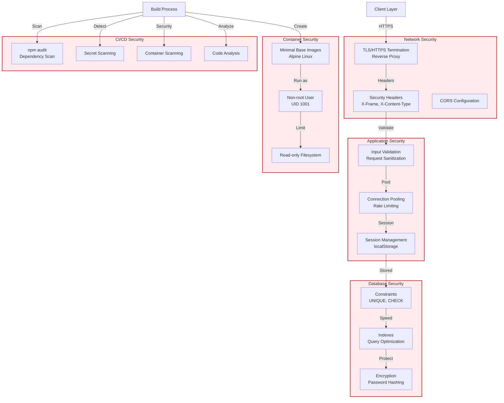
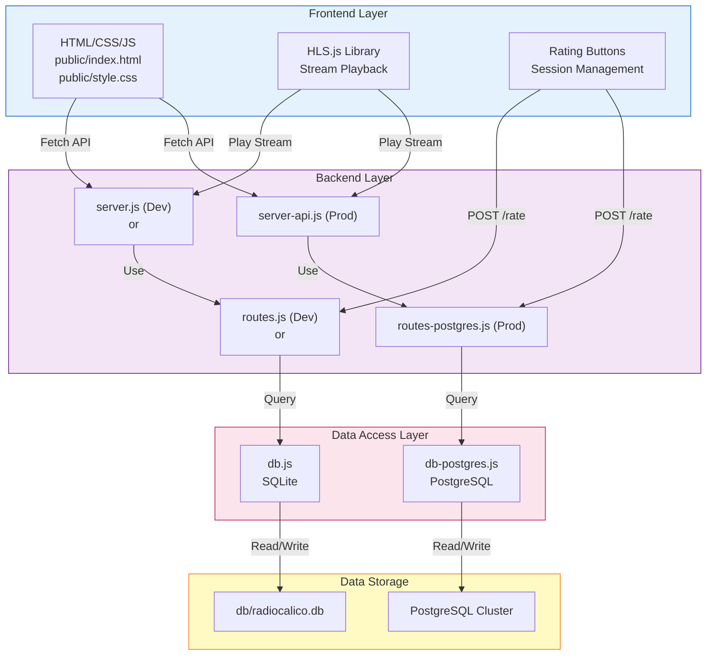
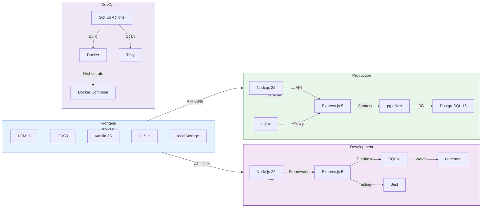
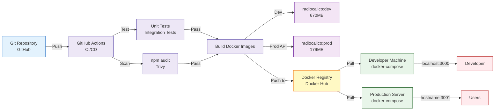
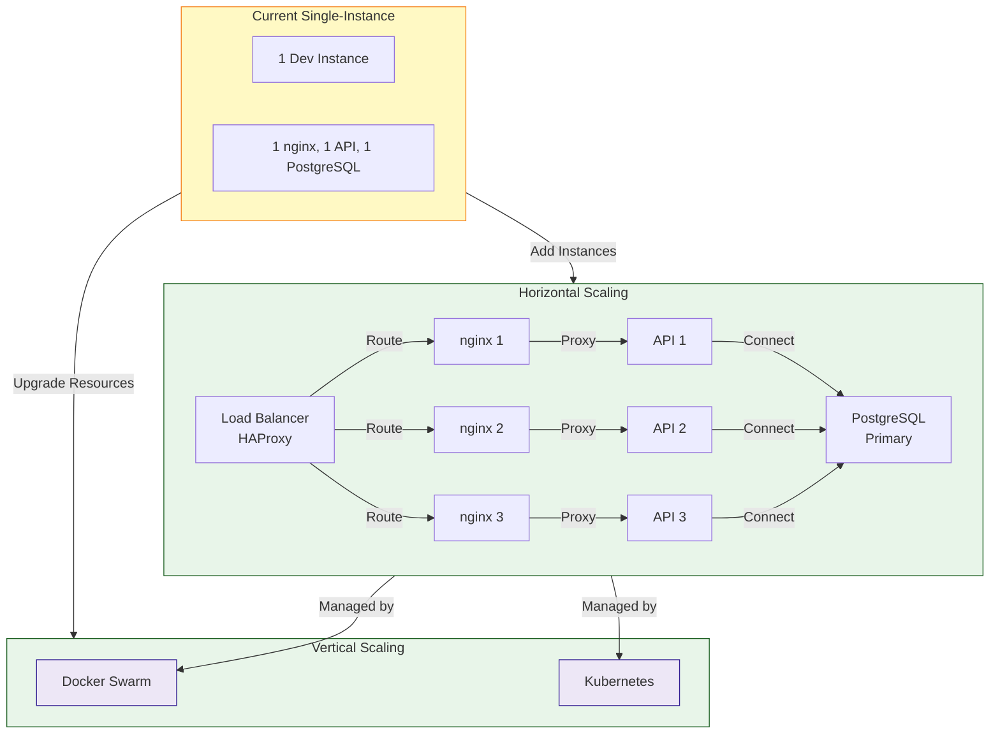

# RadioCalico System Architecture

## Complete System Overview

```mermaid
graph TB
    subgraph "Client Layer"
        Browser["🌐 Web Browser<br/>Chrome/Firefox/Safari/Edge"]
        HLS["HLS.js Library<br/>Stream Playback"]
    end

    subgraph "Development Stack"
        DevExpress["Express.js<br/>Port 3000"]
        SQLiteDB["SQLite<br/>Local File"]
        DevServer["nodemon<br/>Hot-reload"]
    end

    subgraph "Production Stack"
        subgraph "Web Layer"
            Nginx["nginx Alpine<br/>Port 80/3001<br/>Reverse Proxy"]
        end
        
        subgraph "API Layer"
            ExpressAPI["Express.js<br/>Port 3000<br/>API Only"]
            PoolConnection["Connection Pool<br/>20 Max Connections"]
        end
        
        subgraph "Database Layer"
            PostgreSQL["PostgreSQL 16<br/>Port 5432<br/>Production DB"]
            WAL["WAL Mode<br/>Atomic Writes"]
        end
    end

    subgraph "HLS Streaming"
        HLSStream["HLS Stream Generator<br/>ID3 Metadata"]
        Segments["MPEG-TS Segments<br/>Cached 5s"]
        Manifest["M3u8 Manifest<br/>Playlist"]
    end

    subgraph "Data Models"
        Users["Users Table<br/>Accounts"]
        Tracks["Played Tracks Table<br/>History"]
        Ratings["Ratings Table<br/>UNIQUE Constraint"]
    end

    subgraph "API Endpoints"
        HealthEP["GET /health<br/>Status Check"]
        NowPlayingEP["GET/POST /api/now-playing<br/>Track Management"]
        RateEP["POST /api/rate<br/>Rating Submission"]
        RatingsEP["GET /api/ratings/:title<br/>Rating Retrieval"]
        RecentEP["GET /api/recently-played<br/>History"]
        UsersEP["GET/POST /api/users<br/>User Management"]
    end

    subgraph "Features"
        Rating["Rating System<br/>Thumbs Up/Down"]
        Session["Session Management<br/>localStorage"]
        VolumeCtrl["Volume Control<br/>Persistent"]
        Visualizer["Waveform Visualizer<br/>Animations"]
        Vinyl["Spinning Vinyl<br/>Animation"]
    end

    subgraph CICD["CI/CD Pipeline"]
        GitHub["GitHub Actions"]
        Testing["Unit Tests<br/>Integration Tests"]
        Security["Security Scanning<br/>npm audit, Trivy"]
        Docker["Docker Build"]
    end

    %% Client connections
    Browser -->|HTTP/HTTPS| Nginx
    Browser -->|HTTP/HTTPS| DevExpress
    Browser -->|Fetch HLS| HLSStream
    HLS -->|Parse ID3| Segments

    %% Development stack
    DevExpress -->|Auto-reload| DevServer
    DevExpress -->|Query/Persist| SQLiteDB
    DevExpress -->|Generate| HLSStream

    %% Production stack - Web Layer
    Nginx -->|Reverse Proxy| ExpressAPI
    Nginx -->|Serve Static| Browser
    Nginx -->|Cache Assets| Manifest
    Nginx -->|Cache Segments| Segments

    %% Production stack - API Layer
    ExpressAPI -->|Query| PoolConnection
    PoolConnection -->|Connect| PostgreSQL
    ExpressAPI -->|Generate| HLSStream

    %% Database connections
    PostgreSQL -->|Store| Users
    PostgreSQL -->|Store| Tracks
    PostgreSQL -->|Store| Ratings
    PostgreSQL -->|WAL Mode| WAL

    %% HLS Streaming
    HLSStream -->|Create| Segments
    HLSStream -->|Generate| Manifest
    Segments -->|Include| Ratings

    %% API Endpoints
    ExpressAPI -->|Implements| HealthEP
    ExpressAPI -->|Implements| NowPlayingEP
    ExpressAPI -->|Implements| RateEP
    ExpressAPI -->|Implements| RatingsEP
    ExpressAPI -->|Implements| RecentEP
    ExpressAPI -->|Implements| UsersEP

    %% Features
    Browser -->|Uses| Rating
    Browser -->|Uses| Session
    Browser -->|Uses| VolumeCtrl
    Browser -->|Uses| Visualizer
    Browser -->|Uses| Vinyl

    %% CI/CD
    GitHub -->|Runs| Testing
    GitHub -->|Runs| Security
    GitHub -->|Builds| Docker
    Docker -->|Creates| Nginx
    Docker -->|Creates| ExpressAPI
    Docker -->|Creates| PostgreSQL

    %% Styling
    classDef client fill:#e1f5ff,stroke:#01579b,stroke-width:2px
    classDef dev fill:#f3e5f5,stroke:#4a148c,stroke-width:2px
    classDef prod fill:#e8f5e9,stroke:#1b5e20,stroke-width:2px
    classDef data fill:#fce4ec,stroke:#880e4f,stroke-width:2px
    classDef api fill:#fff3e0,stroke:#e65100,stroke-width:2px
    classDef streaming fill:#f1f8e9,stroke:#33691e,stroke-width:2px
    classDef ci fill:#ede7f6,stroke:#311b92,stroke-width:2px

    class Browser,HLS client
    class DevExpress,SQLiteDB,DevServer dev
    class Nginx,ExpressAPI,PostgreSQL,PoolConnection,WAL prod
    class Users,Tracks,Ratings data
    class HealthEP,NowPlayingEP,RateEP,RatingsEP,RecentEP,UsersEP api
    class HLSStream,Segments,Manifest streaming
    class CICD ci
```



---

## Development vs Production Architecture

### Development Architecture (Single Container)



### Production Architecture (Multi-Service)

```mermaid
graph TB
    Client["🌐 Browser<br/>External Users"]
    
    subgraph ProdStack ["Production Environment"]
        subgraph WebLayer ["Web Server"]
            Nginx["nginx Alpine<br/>Port 3001 ← 80<br/>- Reverse Proxy<br/>- Static Files<br/>- Compression<br/>- Security Headers"]
        end
        
        subgraph APILayer ["API Server"]
            Express["Express.js Alpine<br/>Port 3000 Internal<br/>- REST API<br/>- HLS Generation<br/>- Request Validation"]
            Pool["Connection Pool<br/>20 Max Concurrent"]
        end
        
        subgraph DBLayer ["Data Layer"]
            Postgres["PostgreSQL Alpine<br/>Port 5432 Internal<br/>- Relational DB<br/>- ACID Compliance<br/>- Connection Pooling"]
        end
    end

    Client -->|HTTP/HTTPS| Nginx
    Nginx -->|Proxy /api/*| Express
    Nginx -->|Serve *.js|*.css| Client
    Express -->|Pool| Pool
    Pool -->|Query| Postgres
    Express -->|Generate| HLS["HLS Streams<br/>ID3 Metadata"]
    HLS -->|Cached 5s| Nginx
    Client -->|Play| HLS

    classDef prod fill:#e8f5e9,stroke:#1b5e20,stroke-width:2px
    classDef client fill:#e1f5ff,stroke:#01579b,stroke-width:2px
    class ProdStack prod
    class Client client
```

---

## Data Flow Diagram



---

## Database Schema Diagram

```mermaid
erDiagram
    USERS ||--o{ RATINGS : has
    PLAYED_TRACKS ||--o{ RATINGS : recorded_as
    RATINGS }o--|| USERS : "rated_by"
    RATINGS }o--|| PLAYED_TRACKS : "for_track"

    USERS {
        int id PK
        string name
        string email UK
        datetime created_at
    }

    PLAYED_TRACKS {
        int id PK
        string title
        string artist
        datetime played_at
    }

    RATINGS {
        int id PK
        string session_id
        string track_title FK
        string track_artist FK
        int rating "1 or -1"
        datetime created_at
        unique "session_id, track_title, track_artist"
    }
```

---

## Deployment Architecture



---

## Port Mapping & Networking



---

## Security Layers



---

## Component Interactions



---

## Technology Stack Matrix



---

## Key Statistics

| Component | Dev | Prod |
|---|---|---|
| **Containers** | 1 | 3 |
| **Image Size** | 670MB | 179MB (API) + 50MB (nginx) + 250MB (postgres) |
| **Database** | SQLite (file) | PostgreSQL (network) |
| **Startup Time** | ~2s | ~8s |
| **Health Checks** | Yes | Yes (all 3 services) |
| **Auto-reload** | Yes (nodemon) | No (production) |
| **Caching** | App-level | nginx + database |
| **Concurrency** | Single-threaded | 20 DB connections |
| **Scaling** | N/A | Horizontal (multiple API instances) |

---

## Deployment Flow



---

## System Scalability


